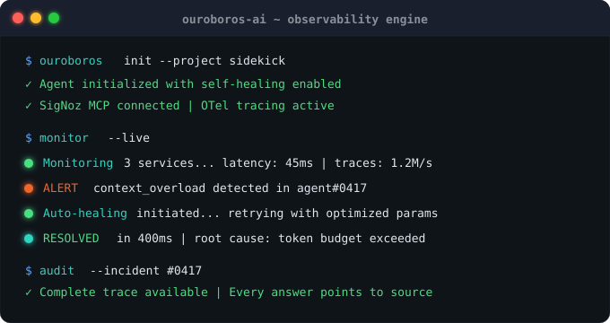

<div align="center">

# Ouroboros AI

### Self-healing observability for AI agents

Ouroboros instruments your AI agent with OpenTelemetry and detects failure patterns in real time via SigNoz.  
AI agents fail. Ouroboros catches the failure, heals it automatically, and tells you exactly what happened.

</div>

---

## The Problem

AI agents in production fail silently. When a context overload, slow span, or failed operation occurs, you're left hunting through logs manually, trying to piece together what broke and why — long after the damage is done.

**Ouroboros AI closes that loop automatically.**

---

## How It Works

<p align="center">
  
</p>


| Step | Component | What happens |
|------|-----------|--------------|
| **01 Chaos** | `otel-demo/app_deep.py` | Simulated AI agent runs continuously, triggering context overloads and slow operations |
| **02 Traced** | OpenTelemetry → SigNoz | Every action is instrumented and sent to SigNoz in real time |
| **03 Alert** | SigNoz Alerts | Failure pattern detected, webhook fired automatically |
| **04 Heal** | `otel-demo/auto_healer.py` | Webhook received, operation retried with corrected parameters — zero human intervention |
| **05 Explain** | Sidekick + Groq + MCP | Ask anything in plain English; Sidekick reads real trace data from SigNoz via MCP and answers |

---

## Tech Stack

| Layer | Technology |
|-------|-----------|
| Observability Backend | SigNoz (self-hosted via Foundry/Docker) |
| Tracing | OpenTelemetry |
| AI Reasoning | Groq — `llama-3.1-8b-instant` |
| Agent ↔ SigNoz Bridge | SigNoz MCP Server (Model Context Protocol) |
| Web Backend | Flask (Python) |
| UI | Vanilla HTML/CSS/JS |

---

## Project Structure

```
ouroboros-ai/
│
├── casting.yaml                  # Foundry config — spins up SigNoz + MCP
├── terminal-card.svg             # Animated terminal card (shown above)
│
├── sidekick/                     # AI Sidekick — backend + UI
│   ├── sidekick.py               # Flask app (routes: /, /app, /ask)
│   ├── agent.py                  # Groq + MCP reasoning loop
│   ├── mcp_client.py             # MCP JSON-RPC client
│   ├── requirements.txt
│   ├── .env.example
│   └── templates/
│       ├── landing.html          # Marketing landing page
│       └── index.html            # Sidekick chat dashboard
│
└── agent/                    # Chaos generator + auto-healer
    ├── app_deep.py               # Sends chaos traces to SigNoz
    └── auto_healer.py            # Webhook receiver — retries failed ops
```

---

## Getting Started

### Prerequisites

- [Docker Desktop](https://www.docker.com/products/docker-desktop/) running
- [Foundry CLI](https://signoz.io/docs/operate/foundry/) installed
- Python 3.10+
- A free [Groq API key](https://console.groq.com)

### 1. Clone the repo

```bash
git clone https://github.com/YOUR_USERNAME/ouroboros-ai.git
cd ouroboros-ai
```

### 2. Set up environment

```bash
cp sidekick/.env.example sidekick/.env
# Edit sidekick/.env and fill in your SIGNOZ_API_KEY and GROQ_API_KEY
```

### 3. Start SigNoz + MCP server

```bash
foundryctl cast apply
```

Verify MCP is live:

```bash
curl -fsS localhost:8000/livez && echo "OK"
```

### 4. Install Sidekick dependencies

```bash
cd sidekick
python3 -m venv venv
source venv/bin/activate
pip install -r requirements.txt
cd ..
```

### 5. Install otel-demo dependencies

```bash
cd agent
pip install opentelemetry-sdk opentelemetry-exporter-otlp-proto-grpc flask
cd ..
```

### 6. Run everything

Open **3 terminals**, each from the project root (`ouroboros-ai/`):

**Terminal 1 — Sidekick:**
```bash
cd sidekick && source venv/bin/activate && python sidekick.py
```

You should see:
```
INFO:root:Loaded 41 MCP tools
🚀 Ouroboros Sidekick on http://localhost:3001
```

**Terminal 2 — Chaos generator:**
```bash
cd agent && python3 app_deep.py
```

You should see:
```
🚀 Starting Ouroboros telemetry generator... (Ctrl+C to stop)
✅ Sent 10 traces to SigNoz...
```

**Terminal 3 — Auto-healer:**
```bash
cd otel-demo && python3 auto_healer.py
```

You should see:
```
🛡️ Auto-Healer service starting on http://localhost:5000
```

### 7. Open the app

| URL | What's there |
|-----|-------------|
| `localhost:3001` | Landing page |
| `localhost:3001/app` | Sidekick chat dashboard |
| `localhost:8080` | SigNoz observability UI |

---

## Talking to the Sidekick

Ask anything about your running agents via the chat dashboard, or directly via curl:

```bash
curl -s -X POST http://localhost:3001/ask \
  -H "Content-Type: application/json" \
  -d '{"question":"Which services are currently being monitored in SigNoz?"}' | python3 -m json.tool
```

**Example questions:**
- *"Which services are currently being monitored in SigNoz?"*
- *"Get recent traces from deep-agent-service and tell me what you find"*
- *"What is the average latency of the deep-agent-service?"*

**Example response:**
```json
{
  "answer": "The services currently being monitored are:\n- auto-healer-service — 1 trace in the last hour (avg ~494ms)\n- deep-agent-service — 688 traces in the last hour (avg ~1.63s)",
  "latency_ms": 1488,
  "tools_used": ["signoz_list_services"]
}
```

---

## Testing the Auto-Healer

Trigger the webhook manually to verify the self-healing loop:

```bash
curl -s -X POST http://localhost:5000/webhook \
  -H "Content-Type: application/json" \
  -d '{"alertname":"ContextOverload","status":"firing","labels":{"alertname":"ContextOverload"}}' | python3 -m json.tool
```

Expected response:
```json
{
  "message": "Request auto-healed with optimized parameters",
  "result": "Optimized response",
  "status": "healed"
}
```

---

## How the MCP Reasoning Loop Works

1. User sends a question to `/ask`
2. `agent.py` calls `mcp_client.py` → connects to SigNoz MCP at `localhost:8000`
3. MCP returns 41 available tools (traces, logs, metrics, spans, services)
4. Tools are passed to Groq alongside the user's question
5. Groq decides which tools to call, calls them, and gets real SigNoz data back
6. Up to 6 reasoning rounds until a confident answer is formed
7. Answer + tool usage stats returned to the UI

**Whitelisted MCP tools:**
`signoz_list_services` · `signoz_get_traces` · `signoz_get_logs` · `signoz_get_metrics` · `signoz_get_span`

---

## Built By

<p align="center"><b>Sagar & Disha</b> — Built for the SigNoz Observability Hackathon (July 2026).</p>

---

## License

> [!NOTE]
> **MIT License** — free to use, modify, and distribute.